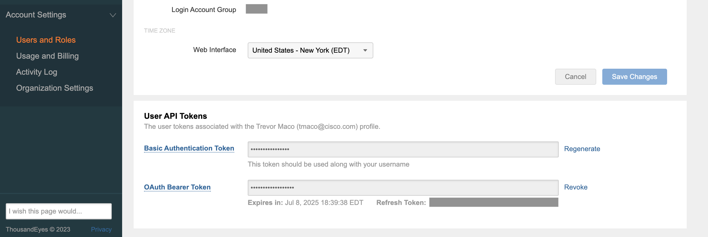
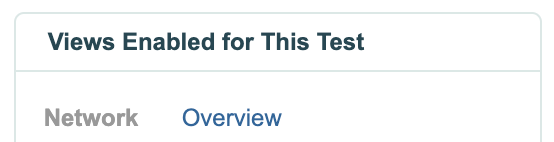
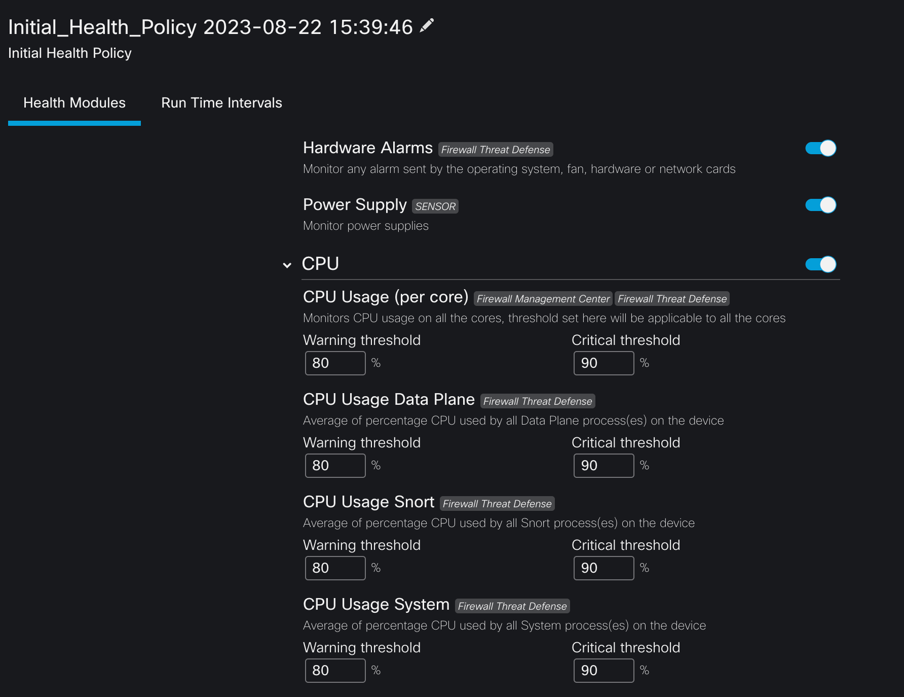
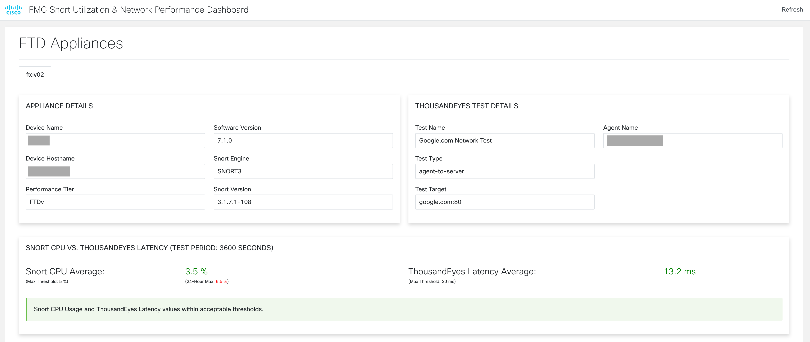
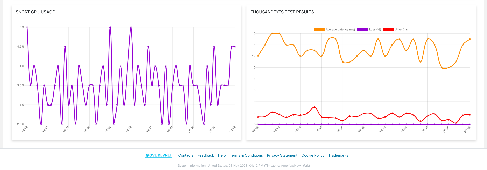

# FMC Snort Utilization & Network Performance Dashboard

This dashboard displays `FTD SNORT CPU Usage` and `ThousandEyes Network Performance` data for visualizing the relationship between poor network performance and high SNORT CPU usage. 

The dashboard takes the `average` SNORT CPU and Network Latency over a defined `period` and compares them against defined `thresholds`. If one or both metrics exceed the thresholds, a clear alert is displayed to the screen highlighting a possible correlation. 

**Note**: This dashboard assumes a ThousandEyes test with network performance data has been preconfigured and SNORT CPU data is available (see `Prerequisites`)

## Contacts
* Trevor Maco

## Solution Components
* FMC 
* ThousandEyes
* Python 3.11

## Prerequisites

### Docker
This app provides a `Docker` file for easy deployment (optional). To use Docker, install it [here](https://docs.docker.com/get-docker/).

### ThousandEyes

To use the ThousandEyes APIs, a  `Bearer Token` is required for a user with the `API access` permissions. To generate a Bearer Token, go to `Account Settings > Users and Roles > User API Tokens` and generate a OAuth Bearer Token. Note this token.



`ThousandEyes Test(s)`: This dashboard assumes a ThousandEyes test exists for each FTD. Test configuration is flexible and follows the standard creation of tests. The usefulness of the dashboard directly correlates with the appropriateness of the ThousandEyes test. **Please configure a test with traffic that passes through the respective FTD.**

The test type must return `Network Overview` results (otherwise the TE dashboard section will be blank).




### FMC/FTD

To access SNORT CPU data per FTD device, a `Health Policy` with the appropriate configuration must be applied to all FTD devices you wish to monitor. To create this policy, refer to the steps below:

1. Create a new Health Policy (Health > Policy > **Create Policy**)
2. Provide a Name and Select a Base Policy
3. Edit the policy > Under **Health Modules**, select `CPU`
4. Enable CPU (Disabled by Default)
5. Deploy the policy to the FTD devices



For more information on device health monitoring, please refer to this [guide](https://www.cisco.com/c/en/us/support/docs/software-resources/220193-upgrade-fp-device-health-monitoring.html#anc6).

**Note:** you will also need an FMC `Username` and `Password` for authentication. It's recommend to create a dedicated **User** for this dashboard. Using an existing user forcibly logs out all other sessions with that User. 


## Installation/Configuration
1. Clone this repository with `git clone [repository name]`
2. Rename the `.env_sample` file to `.env`. Rename `config_sample.py` to `config.py` (in the `flask_app` folder).
3. Add FMC Host/Credentials and ThousandEyes token to environment variables in `.env`.
```dotenv
# FMC
FMC_HOSTNAME="X.X.X.X"
FMC_USERNAME="username"
FMC_PASSWORD="password"

# ThousandEyes
THOUSAND_EYES_TOKEN="XXXXXXXXX"
```
4. Configure parameters related to the `average` calculation and `thresholds` in `config.py`. Define the **mapping of ThousandEyes tests to FTD appliances** here as well (FTD Name -> TE Test Name). This mapping is **critically important** to ensure the SNORT CPU and TE data is correctly associated with each other.
```
Note: If the TE test doesn't exist or the mapping is incorrect (FTD device doesn't exist, etc.) the TE section will be blank for the FTD device and display an 'Unknown' average.
```
```python
# FMC Health Metrics
TIME_PERIOD_SECONDS = 3600  # Default of the last hour worth of data

# Thresholds for Equation
MAX_SNORT_UTILIZATION = 5  # Whole percentages only (ex: 5, 10, 85, etc.)
MAX_TE_LATENCY = 20  # Whole ms numbers only (ex: 5, 10, 85, etc.)

# ThousandEyes Network Test mappings to FTD devices (FTD Device Name -> ThousandEyes Network Test Name)
TE_TEST_MAPPING = {
    '<ftd_device_name>': '<thousand_eyes_test_name>'
}
```
5. Set up a Python virtual environment. Make sure Python 3 is installed in your environment, and if not, you may download Python [here](https://www.python.org/downloads/). Once Python 3 is installed in your environment, you can activate the virtual environment with the instructions found [here](https://docs.python.org/3/tutorial/venv.html).
6. Install the requirements with `pip3 install -r requirements.txt`


## Usage

To launch the dashboard, use the command:
```bash
$ python3 app.py
```

The dashboard can also be launched via `docker` using:
```bash
$ docker-compose up -d --build
```

The main landing page looks like:




The page is organized with each FTD device receiving a tab, and the following sections:
* FTD Appliance Details, ThousandEyes Test Details
* SNORT CPU vs ThousandEyes Average Latency (with a possible alert message)
* Graphical Visualization of SNORT CPU and ThousandEyes Test Data over time period


### LICENSE

Provided under Cisco Sample Code License, for details see [LICENSE](LICENSE.md)

### CODE_OF_CONDUCT

Our code of conduct is available [here](CODE_OF_CONDUCT.md)

### CONTRIBUTING

See our contributing guidelines [here](CONTRIBUTING.md)

#### DISCLAIMER:
<b>Please note:</b> This script is meant for demo purposes only. All tools/ scripts in this repo are released for use "AS IS" without any warranties of any kind, including, but not limited to their installation, use, or performance. Any use of these scripts and tools is at your own risk. There is no guarantee that they have been through thorough testing in a comparable environment and we are not responsible for any damage or data loss incurred with their use.
You are responsible for reviewing and testing any scripts you run thoroughly before use in any non-testing environment.